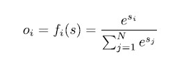
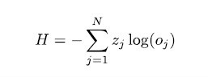

# Lab 2 - Feedforward Network and Backpropagation

## Objective
1. Understand Backpropagation
2. Write a neural network with one or more hidden layers
3. Solve the XOR
4. Understand how to build general classifiers

## Concept of Backpropagation

## Example
Suppose your training data was made by two different sets:
- A) 2 Points sampled according to a uniform distribution in the range [0,5];
- B) 2 Points sampled according to a uniform distribution in the range [0,10].

You need to create a network that, given two random points in the interval [0,10], gives as an output the probability of belonging to class A and to class B.

NOTE THAT: something like [3.5, 4.2] could, in theory, belong to both classes (but it belongs to one of the two classes with higher probability!)

In reality: most often we are not able to distinguish exactly between a number N of classes and what we need is a **“best guess”**. - FOR EXAMPLE: nationality (multi)

## Different Activation & Error Function

### Softmax

This function rescales the outputs in the range [0,1] and sets their sum equal to 1 so
that the output represents the “probability” that the corresponding input would belong to
one of the classes.

### cross-entropy function

Cross-entropy loss, measures the performance of a classification model whose output is a probability value between 0 and 1, and the error increases as the predicted probability deviates from the actual label.

A perfect model would have a loss of 0.